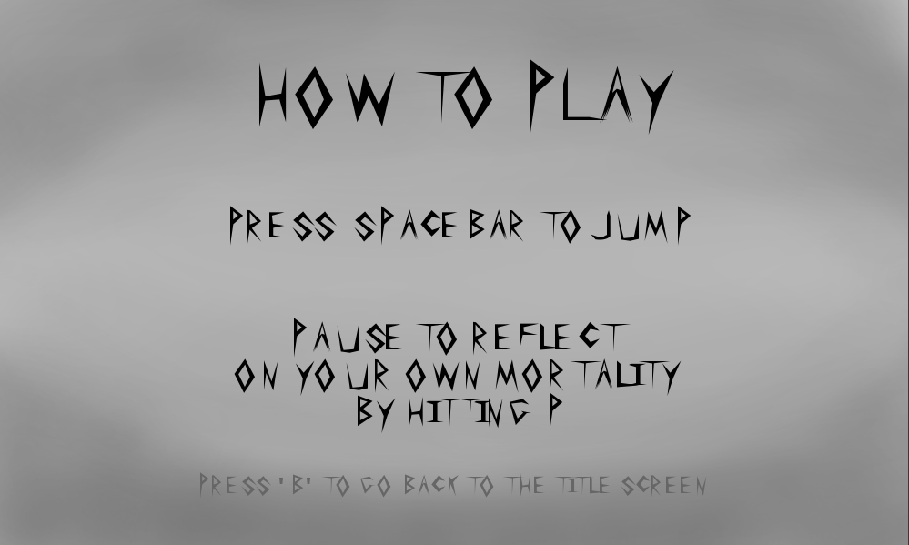
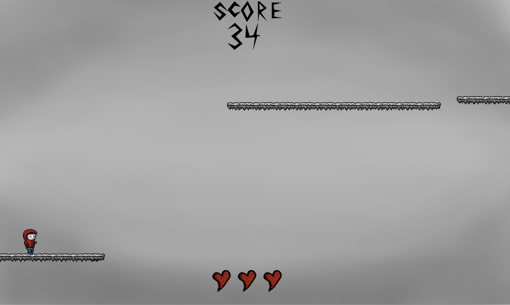
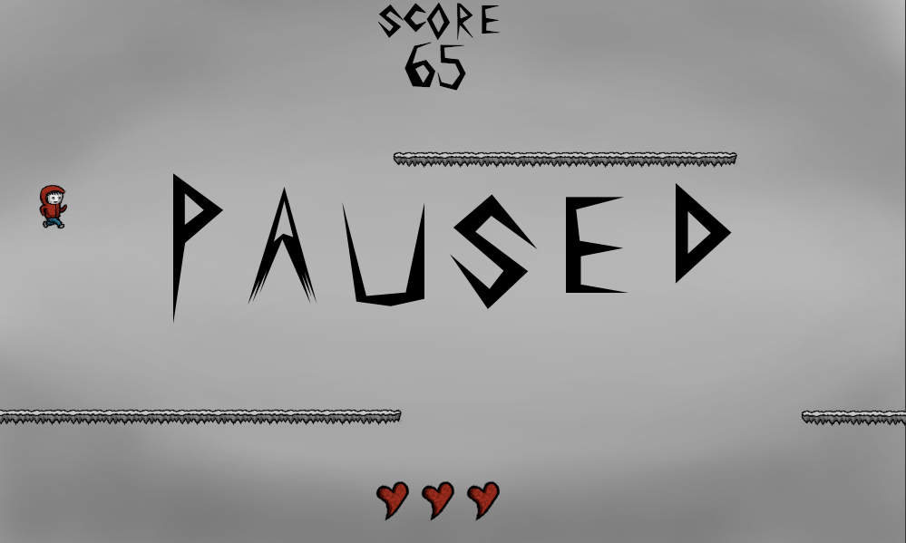
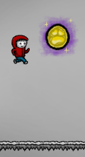
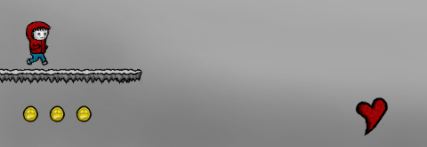
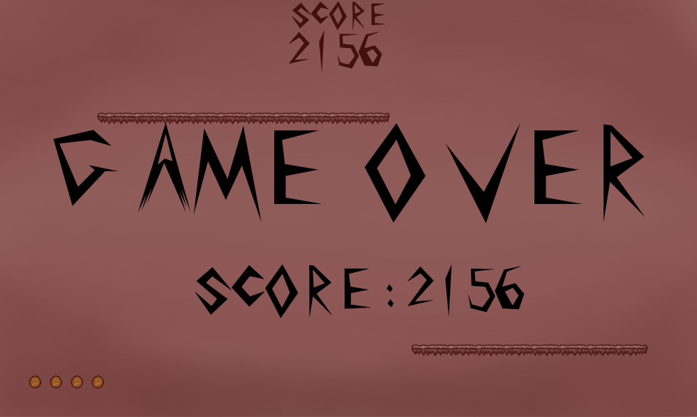

# Platform Jumper #

## About

Platform Jumper is an infinite platformer with a dark, nihilist theme.  You play
as the Jumper, a gender-non-specified person trapped in a dangerous world.  The
Jumper is constantly running from some unspecified doom, jumping from platform to
platform in order to avoid falling to their death.  Treasures will appear as the
Jumper advances, and collecting them will add to your score.  Keep the Jumper
alive as long as you can while you try to collect coins!

## Controls

Spacebar: Makes the Jumper jump.  The jumper can jump from platforms and also once
  in midair.
'P': Pauses the game.  Press again to unpause.

## Playing the Game

The game can be found at http://platformjumper.com.  Upon loading the game, you
will see the following Title Screen with instructions on how to proceed.

Pressing the 'H' key will bring you to the "How to Play" screen.  Pressing 'enter'
will return you to the title screen.

Pressing the 'A' key (or simply waiting a few seconds) will start the "About"
sequence.  This gives an introduction to the game.  You can press 'enter' at any
point to return to the title screen.

Pressing 'enter' on the title screen will start the game.  You will now see the
Jumper on the starting platform.  You can see the score display at the top of the
screen.  Your score increases as you survive.  The longer you live, the higher
your score. At the bottom, you can see your lives displayed.  You start with three
lives.

Pressing the 'P' key will pause the game.  Press it again to unpause.

Platforms will randomly generate on the right side of the screen. Use the space
bar to jump to navigate from platform to platform.  The Jumper can jump from a
platform, but can also muster the energy to jump in midair.  After jumping in the
air, the Jumper must land on a platform to regain the ability to jump in midair.

Treasures will also appear from the right side of the screen.  Try and collect these
as you navigate from platform to platform.

Collecting treasures will increase your score by 50 points.  A bubble will pop up
to indicate the score increase.  You'll also notice that the display at the bottom
will update to keep track of how many treasures you've collected.

Collect 10 treasures and you'll see this bubble, indicating you've gotten an extra
life!

Every time you miss a platform and fall off the bottom of the screen, you will
lose a life and be brought back to the starting platform.  You still have your
score and all the coins you've collected so far.  However, lose your last life
and the game will end.

After a short delay, the Title screen will load and you can play again.

## More Information

For more detailed information on the various aspects and features, check out my
<a href="./docs/readme.md">design doc!</a>
